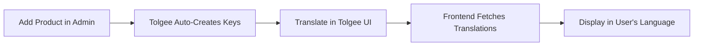

# FORMÉ HAUS - Tolgee Multilingual Setup Guide

## 🌍 Overview

Tolgee is now integrated into FORMÉ HAUS to provide professional translation management for products, collections, categories, and more. This enables seamless EN/AR (and future languages) support with an admin UI for managing translations.

## ✅ What's Already Configured

### Backend (Medusa)
- ✅ `medusa-plugin-tolgee` installed
- ✅ Plugin configured in `medusa-config.ts`
- ✅ Translation fields enabled for:
  - Products: title, subtitle, description
  - Collections: title
  - Categories: name, description
  - Variants: title
  - Options: title
  - Types: value
  - Tags: value
  - Shipping options: name

### Frontend
- ✅ `medusa-service.js` updated to fetch translations
- ✅ Helper methods added:
  - `getTranslatedField(item, field, lang)`
  - `getProductTitle(product, lang)`
  - `getProductDescription(product, lang)`
- ✅ Language parameter support in API calls

## 🚀 Setup Steps

### Step 1: Create Tolgee Account

1. Go to https://app.tolgee.io
2. Sign up for a free account (or use self-hosted)
3. Create a new project named "FORMÉ HAUS"

### Step 2: Configure Languages

1. In your Tolgee project, add languages:
   - **English (en)** - Set as base language
   - **Arabic (ar)** - Add as translation language
2. You can add more languages later (e.g., French, Spanish)

### Step 3: Get API Credentials

1. **Project ID**: 
   - Found in your project URL: `https://app.tolgee.io/projects/YOUR_PROJECT_ID`
   - Copy the number/string at the end

2. **API Key**:
   - Navigate to `/account/apiKeys` in Tolgee
   - Click "Create new API key"
   - Give it a name (e.g., "FORMÉ HAUS Medusa")
   - Copy the generated key

### Step 4: Update Environment Variables

Edit `medusa-storefront/.env`:

```env
TOLGEE_API_URL=https://app.tolgee.io
TOLGEE_API_KEY=tgpak_xxxxxxxxxxxxx  # Your actual API key
TOLGEE_PROJECT_ID=12345              # Your actual project ID
```

### Step 5: Restart Medusa Backend

```bash
cd medusa-storefront
npm run dev
```

### Step 6: Sync Products with Tolgee

1. Open Medusa Admin: http://localhost:9000/app
2. Navigate to any product
3. Scroll to the **"Translations"** section (added by Tolgee plugin)
4. Click **"Sync all"** button
5. Wait for the sync to complete (creates translation keys in Tolgee)

### Step 7: Add Translations in Tolgee

1. Go back to Tolgee dashboard
2. You'll see all your product titles, descriptions, etc. as translation keys
3. Click on any key to add Arabic translation
4. Use the in-context editor or bulk translation features

## 📖 Usage in Frontend

### Fetching Products with Translations

```javascript
import medusaService from './medusa-service.js';
import { getLang } from './i18n.js';

// Get current language
const currentLang = getLang(); // 'en' or 'ar'

// Fetch products with translations
const products = await medusaService.getAllProducts(24, currentLang);

// Display translated title
products.forEach(product => {
  const title = medusaService.getProductTitle(product);
  const description = medusaService.getProductDescription(product);
  
  console.log(`Title: ${title}`);
  console.log(`Description: ${description}`);
});
```

### Manual Translation Access

```javascript
// Access translation directly
const product = await medusaService.getProductByHandle('luxury-abaya', 'ar');

// Get Arabic title if available, fallback to English
const title = product.translations?.ar?.title || product.title;
```

## 🎨 Integration with Existing i18n.js

The Tolgee integration works alongside your existing `i18n.js`:

- **i18n.js**: Handles UI text (nav, buttons, labels)
- **Tolgee**: Handles product/catalog data (titles, descriptions)

When user switches language:
```javascript
// In your language toggle handler
langToggle.addEventListener('change', async (e) => {
    const newLang = e.target.checked ? 'ar' : 'en';
    switchLang(newLang);
    
    // Reload products with new language
    await loadProducts(newLang);
});
```

## 🔧 Advanced Features

### In-Context Translation (Dev Mode)

Press **ALT + Click** on any translated field in the admin to edit directly.

### Automatic Translation

Tolgee supports AI translation services:
- DeepL
- Google Translate
- AWS Translate

Enable in Tolgee project settings for instant translation suggestions.

### Batch Operations

Sync multiple model types at once:
- Products ✓
- Collections ✓
- Categories ✓
- All shipping options ✓

## 📊 Translation Workflow



## 🌟 Benefits

1. **Centralized Management**: All translations in one place
2. **Admin UI**: No code changes needed for translations
3. **Collaboration**: Team members can review/approve translations
4. **AI Assistance**: Automatic translation suggestions
5. **Version Control**: Track translation changes over time
6. **Scalable**: Easy to add new languages

## 🔍 Troubleshooting

### Translations Not Showing?

1. Check API key is valid in `.env`
2. Ensure "Sync all" was clicked in admin
3. Verify translations exist in Tolgee dashboard
4. Check browser console for API errors

### Rate Limit Errors?

Free tier has limits (15 requests per 3 seconds). Consider:
- Increasing `ttl` in config (longer cache)
- Upgrading Tolgee plan
- Self-hosting Tolgee

### Missing Translation Section in Admin?

- Restart Medusa after plugin installation
- Clear browser cache
- Check plugin is in `medusa-config.ts`

## 📚 Resources

- [Tolgee Documentation](https://tolgee.io/docs)
- [Medusa Plugin Tolgee](https://medusajs.com/integrations/medusa-plugin-tolgee/)
- [FORMÉ HAUS i18n.js](./i18n.js)

## 🎯 Next Steps

1. ✅ Set up Tolgee account
2. ✅ Add credentials to `.env`
3. ✅ Restart backend
4. ✅ Sync products
5. ✅ Add Arabic translations
6. ✅ Test on frontend
7. ✅ Deploy with translations

---

**FORMÉ HAUS** - Where Essence Meets Elegance, in Every Language 🌍
